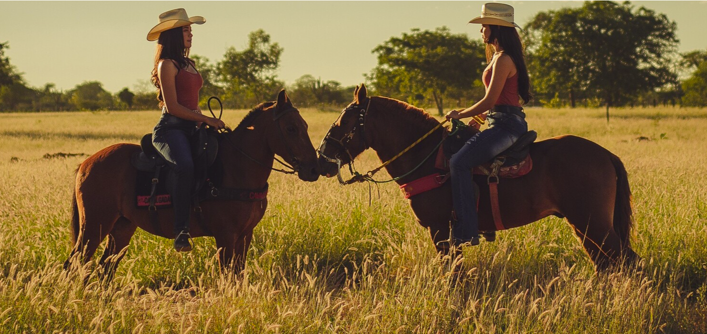
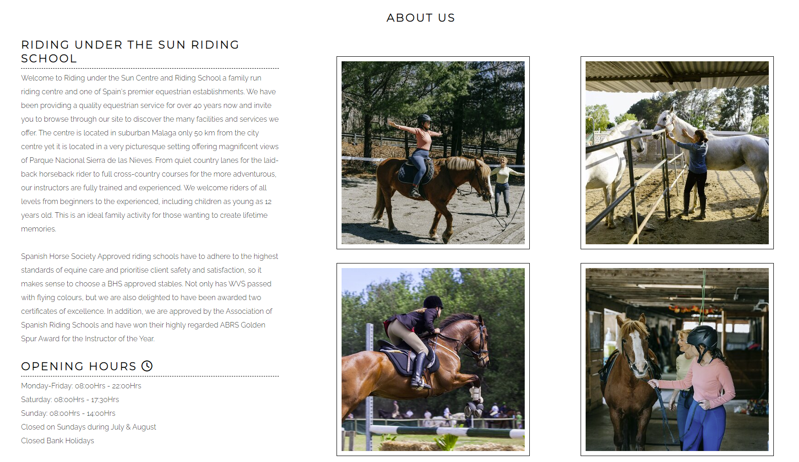
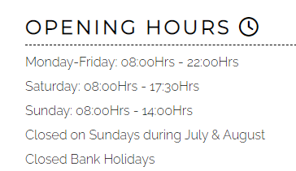
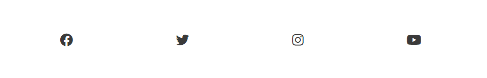
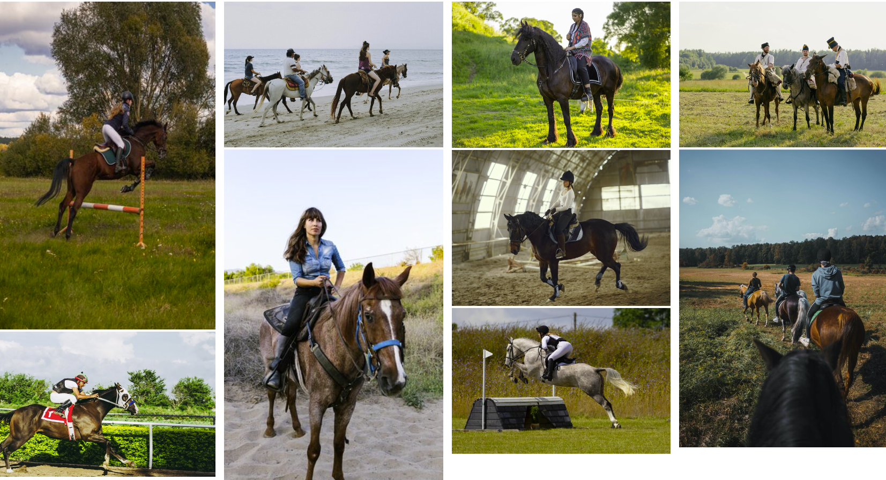

<h1>Riding under the Sun</h1>

Riding under the Sun website aims to promote the club and attract new members. It can be an effective marketing tool for the horse riding club.

The website also provides information about the club and the fees.

Can be also used to showcase the club's horses and facilities by sharing pictures.

<h1>Features</h1>
<h2>Existing features</h2>
<h3> * Navigation Bar</h3>

The identical complete responsive navigation bar, which is included on all three pages and includes links to the Home page, Gallery, and Price List, makes it simple to navigate.

With the help of this section, users will be able to navigate between pages on all devices without constantly pressing the "back" button to return to the previous page.

 

 <h3>* The main page image</h3>
 
The main page includes an image with the purpose to capture the attention of visitors and create a visual impression of what the website is about and what it offers. The image is visually appealing and relevant to the content of the website.

  

<h3> * Riding under the Sun main page section</h3>

The main page section, called "About us", provides information about the club. The section should give visitors an understanding of who the club is, what it does, and what sets it apart from others. 

The "About Us" page can help build trust with visitors by providing information about the people behind the website or company, such as their qualifications, experience, and credentials.

The "About Us" page can be used to establish the credibility of the website or company. This can be done by providing information about the company's history, achievements, and values.

<h3> * Opening Hours</h3>

Will allow the user to see exactly the opening times for the club

<h3>*The Footer</h3>

The footer section includes links to the relevant social media sites for Running under the Sun. The links will open to a new tab to allow easy navigation for the user.

The footer is valuable to the user as it encourages them to keep connected via social media

<h3>Gallery</h3>

The gallery section serves multiple purposes such as: marketing the club, the club's gallery area may also act as a memory bank. It can eventually develop into a priceless archive of the club's past, tracing its development, successes, and turning points.

<h3>Features Left to Implement</h3>

Calendar of Events: A section that displays the club's upcoming events, shows, and activities, with the date, time, location, and a brief description.

Membership: A section that outlines the different types of membership available, the benefits of each membership level, and how to become a member.

News and Updates: A section that features the latest news and updates about the club, such as new initiatives, programs, or services, and any changes to the schedule.

 
<h3>Testing</h3>
<h3>Validator testing</h3>
<h3>Unfixed bugs</h3>
<h3>Deployment</h3>

The site was deployed to GitHub pages. The steps to deploy are as follows:

-In the GitHub repository, navigate to the Settings tab

-From the source section drop-down menu, select the Master Branch

-Once the master branch has been selected, the page will be automatically refreshed with a detailed ribbon display to indicate the successful deployment.

-The live link can be found here - https://mihaelab91.github.io/Riding-under-the-sun/

 
<h3>Credits</h3>

Fonts were imported from website https://fonts.google.com/

Main picture and the pictures from the gallery were downloaded from https://www.pexels.com/

All the pictures were resized on iloveimg.com

Instructions on how to implement border style was taken from https://www.w3schools.com/howto/howto_css_style_hr.asp

Instructions on how to style the images was taken from  https://programmersportal.com/

Icons were imported from https://fontawesome.com/

Instructions on how to implement table style was taken from https://www.w3schools.com/css/tryit.asp?filename=trycss_table_fancy

Instructions on how to create the media query style rules were taken from Love Running Project 

Using media queries to un-fixing sticky headers / footers was taken from https://www.w3.org/WAI/WCAG21/Techniques/css/C34

