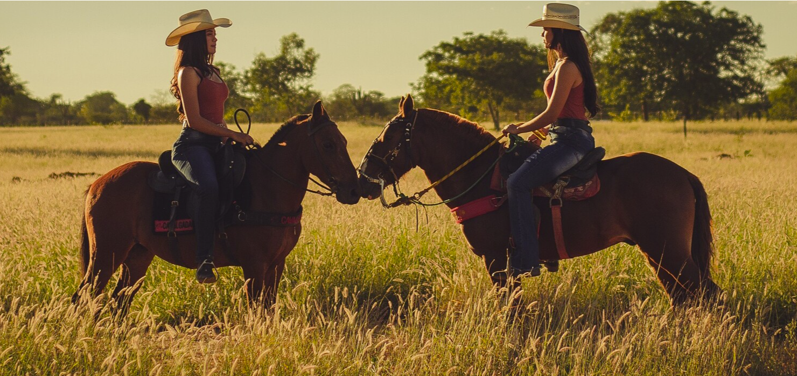
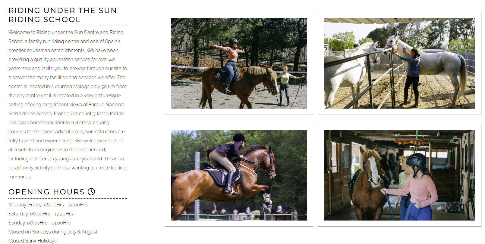
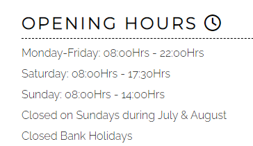

google fonts website imported the fonts
picture downloaded from pexels.com
picture resized on iloveimg.com
border style https://www.w3schools.com/howto/howto_css_style_hr.asp
styling the images https://programmersportal.com/
icon - fontawsome
style the tables https://www.w3schools.com/css/tryit.asp?filename=trycss_table_fancy

<h1>Riding under the Sun</h1>

Riding under the Sun website aims to promote the club and attract new members. It can be an effective marketing tool for the horse riding club.

The website also provides information about the club and the fees.

Can be also used to showcase the club's horses and facilities by sharing pictures.

<h1>Features</h1>
<h2>Existing features</h2>
<h3> * Navigation Bar</h3>

The identical complete responsive navigation bar, which is included on all three pages and includes links to the Home page, Gallery, and Price List, makes it simple to navigate.

With the help of this section, users will be able to navigate between pages on all devices without constantly pressing the "back" button to return to the previous page.

 

 <h3>* The main page image</h3>
 
The main page includes an image with the purpose to capture the attention of visitors and create a visual impression of what the website is about and what it offers. The image is visually appealing and relevant to the content of the website.

 

<h3> * Riding under the Sun main page section</h3>

The main page section, called "About us", provides information about the club. The section should give visitors an understanding of who the club is, what it does, and what sets it apart from others. 

The "About Us" page can help build trust with visitors by providing information about the people behind the website or company, such as their qualifications, experience, and credentials.

The "About Us" page can be used to establish the credibility of the website or company. This can be done by providing information about the company's history, achievements, and values.

<h3> * Opening Hours</h3>

Will allow the user to see exactly the opening times for the club

